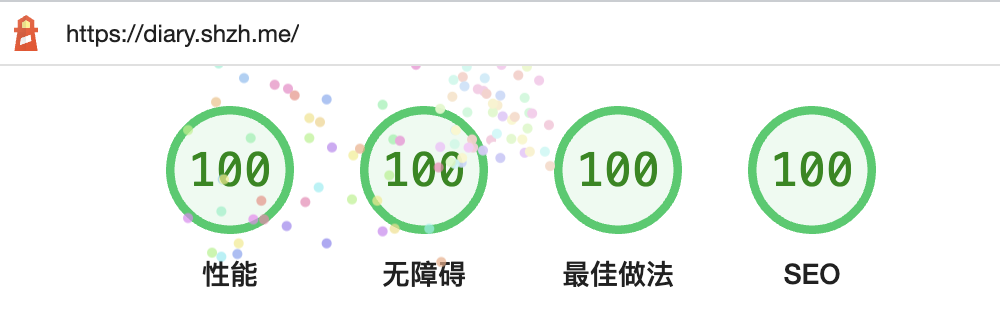
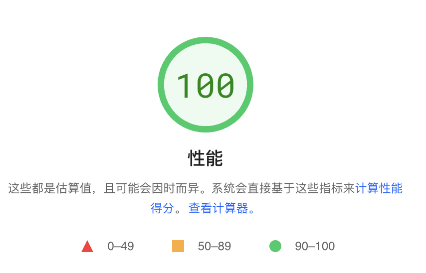

<h1 align="center">ShZh的日记小站</h1>

<i>📖 ShZh的个人日记小站，由Gatsby和heti强势驱动</i>

    
    
  

# 特性

- 极简设计风格，界面简约大气；
- RSS订阅自动探测与发现功能；
- 自适应系统主题的风格变更；

还有一系列特性等待你来发掘。。。（~~编不出来了~~）

# 基准

Lighthouse本地测试（运行在我的Mac M1上）：

Google [PageSpeed Insight](https://pagespeed.web.dev/report?url=https%3A%2F%2Fdiary.shzh.me%2F)测试：

# FAQ

##### 1、为什么没有评论区？

所谓的「日记」并不是那种技术博客，它记录的是作者生活的点点滴滴。

考虑到作者的年龄，这个网页的主流用户群体实际上是作者的中小学同学，而他们不是计算机专业的背景。

为此，评论区设计有两个要点：

- 不能假定用户拥有某个网站的社交账号。比如gitalke和gitment是基于Github的，显然他们都不会有Github账号；
- 不能假定用户会注册相关的社交账号。Github和Disqus是这个道理，自己写认证模块也是。

其实还剩下一种解决方案，那就是像阮一峰那样允许任何人不经过注册就能评论，但是这样风险比较大。

除了需要过滤黑客的攻击之外，还需要杜绝单一用户通过多个马甲评论这一现象。

综上所述，不如直接拿掉评论区。

##### 2、为什么不让用户自己切换主题？

深色主题和浅色主题哪个更护眼，这个是有争议的。

大部分人认为深色主题更加护眼，但是研究表明浅色主题才是最护眼的。

不管事实如何，有一点是不容质疑的：

如果你用深色主题，那么你的软件肯定是深色主题更护眼；浅色主题同理。

所以作者直接剥夺了用户选择的权利，按照系统的主题自适应。

##### 3、如何从文章返回到首页？

这个实际上是一个设计缺陷，主要是因为作者还没有想好这个返回按钮放在哪里。

所以用户目前只能通过浏览器的回退功能返回到首页。

# 参考

本项目在设计上主要参考了以下网站：

- Belleve Invis的个人网站：https://typeof.net/
- vthinkxie的个人网站：https://xieyadong.com/

# 许可

[MIT License](./LICENSE)

Copyright ©️ 2022 Sh-Zh-7
